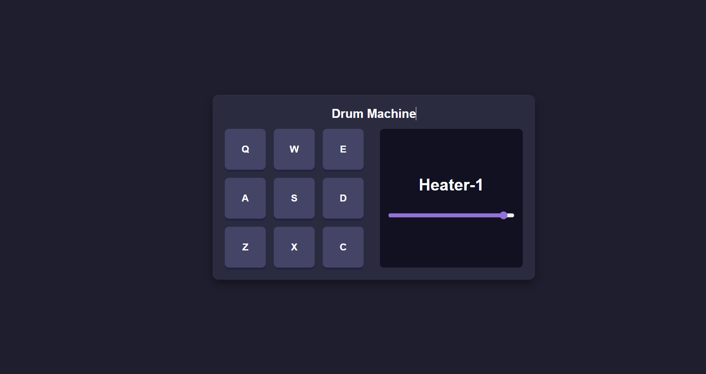

<p align="center">
  <a href="https://drum-machine-zeta-six.vercel.app/" target="_blank">
    
  </a>
</p>

<h1 align="center">Drum Machine</h1>

<p align="center">
  <a href="https://your-drum-machine-demo-link.vercel.app" target="_blank">Live Demo</a> •
  <a href="#project-description">Project Description</a> •
  <a href="#features">Features</a> •
  <a href="#tech-stack">Tech Stack</a> •
  <a href="#installation">Installation</a> •
  <a href="#usage">Usage</a>
</p>



---

## Project Description

**Drum Machine** is a responsive and interactive web application where users can play drum sounds by clicking on pads or pressing corresponding keyboard keys.  
Built with **React**, it demonstrates state management, event handling, and responsive design principles.

🔗 [Live Demo](https://drum-machine-zeta-six.vercel.app/)

---

## Features

- Play sounds by clicking on drum pads or pressing keyboard keys
- Volume control slider for adjusting playback sound
- Visual display showing the name of the sound being played
- Shadow and active states for better interactivity
- Responsive layout for both desktop and mobile views

---

## Tech Stack

- **Frontend**: React
- **Deployment**: Vercel

---

## Installation

```bash
git clone https://github.com/nca-gabriel/drum-machine.git
cd drum-machine
npm install
```

---

## Usage

Start the development server:

```bash
npm run dev
```
